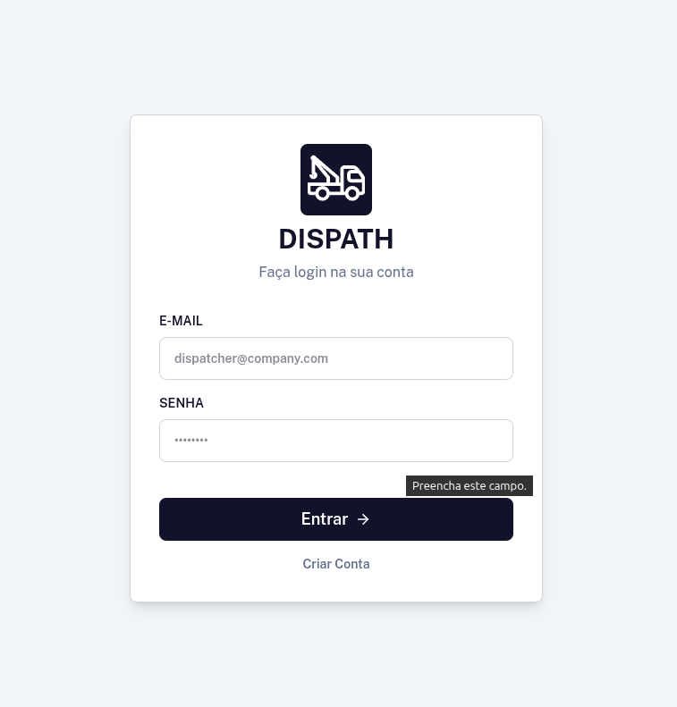
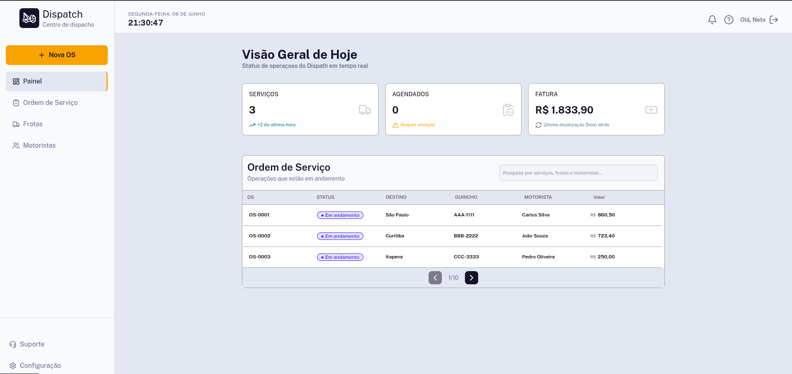
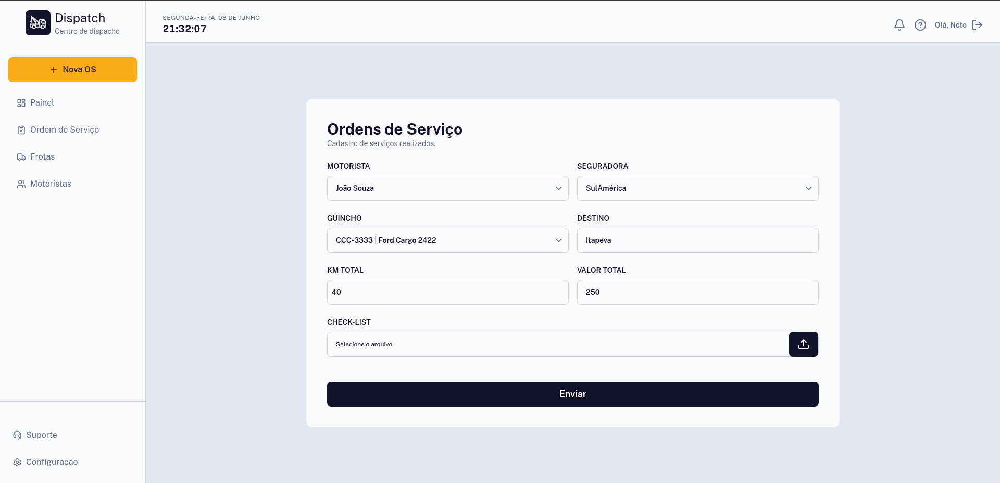

# Dispath

Um aplicativo de gerenciamento de serviços e frotas.

## 📋 Descrição

Criei esse projeto com foco em resolver o problema de onde eu trabalhava. Dispath é uma ferramenta simples e o visual robusto com foco apenas em cadastros de serviços realiados e da frota. 

## 🚀 Funcionalidades

- Cadastros de serviços.
- Manutenção da frota
- Busca rapida de serviços, frota e motoristas.

## 🛠️ Tecnologias Utilizadas

- **React**
- **TypeScript**
- **Tailwind**

---

Desenvolvido por Paulo Neto.
